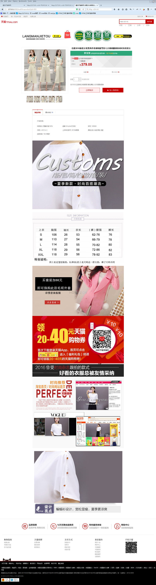
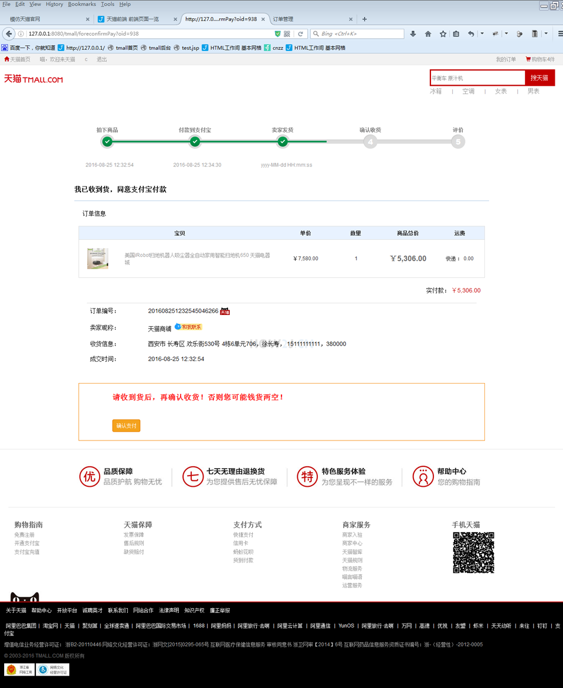
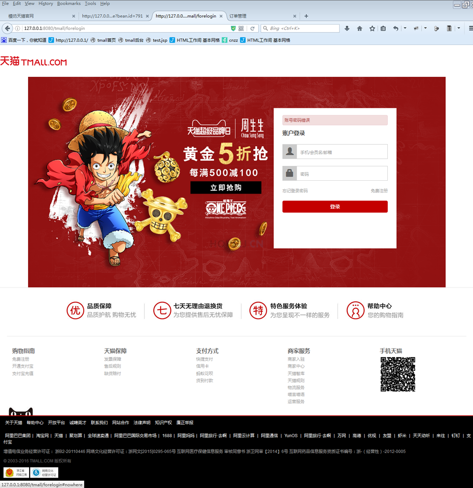

# JS-tmall
基于HTML, CSS, &amp; JS构建的一个具有15个页面，近30个页面组件的desktop site.

[目录架构](#目录架构)

[前台页面截图](#前台页面截图)

### 目录架构
* components
    * common //common components through all pages
        * header
        * footer
        * searchbox
        * simple-searchbox
    * initial 
        * carousel 
        * category
        * category-product 
        * navbar
    * category
        * filter
        * product-list
    * product 
        * basic-info 
        * thumbnail
        * detail 
        * rating        
    * shopping-cart
        * clearing-cart
    * clearing
        * submit-order
        * user-address
    * order
        * order-header
        * order-list
    * utilities
  
 
### 前台页面截图

readme文件补充中 ...

后台开发中 ...
